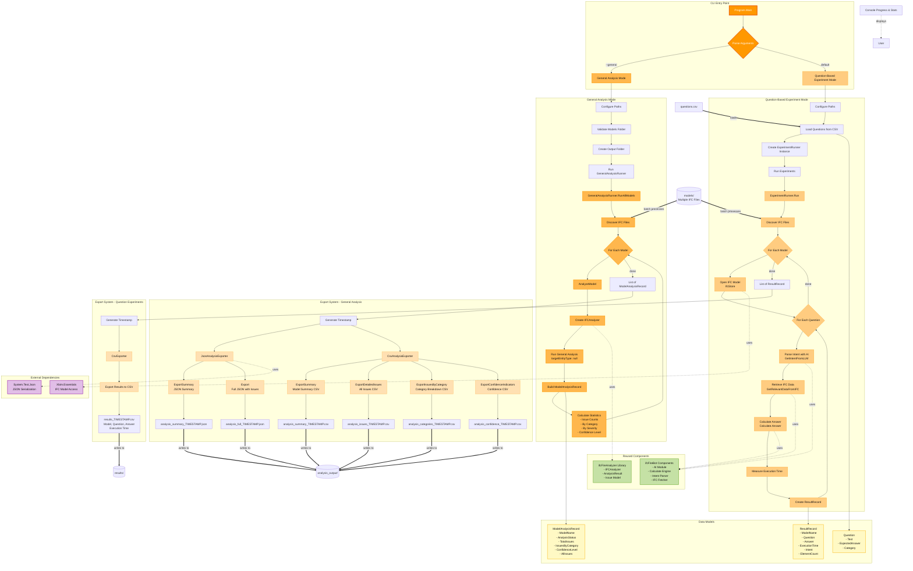

```mermaid
graph TB
    subgraph "CLI Entry Point"
        Main[Program.Main]
        Main --> ArgCheck{Parse Arguments}
        
        ArgCheck -->|--general| GeneralMode[General Analysis Mode]
        ArgCheck -->|default| QuestionMode[Question-Based Experiment Mode]
    end
    
    subgraph "General Analysis Mode"
        GeneralMode --> GM1[Configure Paths]
        GM1 --> GM2[Validate Models Folder]
        GM2 --> GM3[Create Output Folder]
        GM3 --> GM4[Run GeneralAnalysisRunner]
        
        GM4 --> GAR[GeneralAnalysisRunner.RunAllModels]
        GAR --> GAR1[Discover IFC Files]
        GAR1 --> GAR2{For Each Model}
        
        GAR2 --> GAR3[AnalyzeModel]
        GAR3 --> GAR4[Create IFCAnalyzer]
        GAR4 --> GAR5[Run General Analysis<br/>targetEntityType: null]
        GAR5 --> GAR6[Build ModelAnalysisRecord]
        
        GAR6 --> GAR7[Calculate Statistics<br/>- Issue Counts<br/>- By Category<br/>- By Severity<br/>- Confidence Level]
        
        GAR7 --> GAR2
        GAR2 -->|done| GAResults[List of ModelAnalysisRecord]
    end
    
    subgraph "Question-Based Experiment Mode"
        QuestionMode --> QM1[Configure Paths]
        QM1 --> QM2[Load Questions from CSV]
        QM2 --> QM3[Create ExperimentRunner Instance]
        QM3 --> QM4[Run Experiments]
        
        QM4 --> ER[ExperimentRunner.Run]
        ER --> ER1[Discover IFC Files]
        ER1 --> ER2{For Each Model}
        
        ER2 --> ER3[Open IFC Model<br/>IfcStore]
        ER3 --> ER4{For Each Question}
        
        ER4 --> ER5[Parse Intent with AI<br/>GetIntentFromLLM]
        ER5 --> ER6[Retrieve IFC Data<br/>GetRelevantDataFromIFC]
        ER6 --> ER7[Calculate Answer<br/>Calculate.Answer]
        ER7 --> ER8[Measure Execution Time]
        ER8 --> ER9[Create ResultRecord]
        
        ER9 --> ER4
        ER4 -->|done| ER2
        ER2 -->|done| QMResults[List of ResultRecord]
    end
    
    subgraph "Export System - General Analysis"
        GAResults --> EXP1[Generate Timestamp]
        EXP1 --> Export1[JsonAnalysisExporter]
        EXP1 --> Export2[CsvAnalysisExporter]
        
        Export1 --> J1[ExportSummary<br/>JSON Summary]
        Export1 --> J2[Export<br/>Full JSON with Issues]
        
        Export2 --> C1[ExportSummary<br/>Model Summary CSV]
        Export2 --> C2[ExportDetailedIssues<br/>All Issues CSV]
        Export2 --> C3[ExportIssuesByCategory<br/>Category Breakdown CSV]
        Export2 --> C4[ExportConfidenceIndicators<br/>Confidence CSV]
        
        J1 --> Files1[analysis_summary_TIMESTAMP.json]
        J2 --> Files2[analysis_full_TIMESTAMP.json]
        C1 --> Files3[analysis_summary_TIMESTAMP.csv]
        C2 --> Files4[analysis_issues_TIMESTAMP.csv]
        C3 --> Files5[analysis_categories_TIMESTAMP.csv]
        C4 --> Files6[analysis_confidence_TIMESTAMP.csv]
    end
    
    subgraph "Export System - Question Experiments"
        QMResults --> EXP3[Generate Timestamp]
        EXP3 --> Export3[CsvExporter]
        
        Export3 --> C5[Export Results to CSV]
        C5 --> Files7[results_TIMESTAMP.csv<br/>Model, Question, Answer<br/>Execution Time]
    end
    
    subgraph "Data Models"
        DM1[ModelAnalysisRecord<br/>- ModelName<br/>- AnalysisStatus<br/>- TotalIssues<br/>- IssuesByCategory<br/>- ConfidenceLevel<br/>- AllIssues]
        
        DM2[ResultRecord<br/>- ModelName<br/>- Question<br/>- Answer<br/>- ExecutionTime<br/>- Intent<br/>- ElementCount]
        
        DM3[Question<br/>- Text<br/>- ExpectedAnswer<br/>- Category]
        
        GAR6 --> DM1
        ER9 --> DM2
        QM2 --> DM3
    end
    
    subgraph "Reused Components"
        RC1[ifcFireBot Components<br/>- AI Module<br/>- Calculate Engine<br/>- Intent Parser<br/>- IFC Fetcher]
        
        RC2[ifcFireAnalyzer Library<br/>- IFCAnalyzer<br/>- AnalysisResult<br/>- Issue Model]
        
        ER5 -.uses.-> RC1
        ER6 -.uses.-> RC1
        ER7 -.uses.-> RC1
        GAR4 -.uses.-> RC2
    end
    
    subgraph "External Dependencies"
        EXT1[Xbim.Essentials<br/>IFC Model Access]
        EXT2[System.Text.Json<br/>JSON Serialization]
        
        ER3 -.uses.-> EXT1
        Export1 -.uses.-> EXT2
    end
    
    ModelFolder[(models/<br/>Multiple IFC Files)] ==>|batch processes| GAR1
    ModelFolder ==>|batch processes| ER1
    QuestionsCSV[questions.csv] ==>|loads| QM2
    
    Files1 & Files2 & Files3 & Files4 & Files5 & Files6 ==>|writes to| OutputFolder[(analysis_output/)]
    Files7 ==>|writes to| ResultsFolder[(results/)]
    
    Console[Console Progress & Stats] -.displays.-> User[User]
    
    classDef entryClass fill:#ff9800,stroke:#e65100,stroke-width:3px,color:#fff
    classDef generalClass fill:#ffb74d,stroke:#ff9800,stroke-width:2px,color:#111
    classDef questionClass fill:#ffcc80,stroke:#ffb74d,stroke-width:2px,color:#111
    classDef exportClass fill:#ffe0b2,stroke:#ffcc80,stroke-width:2px,color:#111
    classDef dataClass fill:#fff9c4,stroke:#fbc02d,stroke-width:2px,color:#111
    classDef reusedClass fill:#c5e1a5,stroke:#7cb342,stroke-width:2px,color:#111
    classDef externalClass fill:#e1bee7,stroke:#9c27b0,stroke-width:2px,color:#111
    
    class Main,ArgCheck entryClass
    class GeneralMode,GAR,GAR1,GAR2,GAR3,GAR4,GAR5,GAR6,GAR7 generalClass
    class QuestionMode,ER,ER1,ER2,ER3,ER4,ER5,ER6,ER7,ER8,ER9 questionClass
    class Export1,Export2,Export3,J1,J2,C1,C2,C3,C4,C5 exportClass
    class DM1,DM2,DM3 dataClass
    class RC1,RC2 reusedClass
    class EXT1,EXT2 externalClass
```