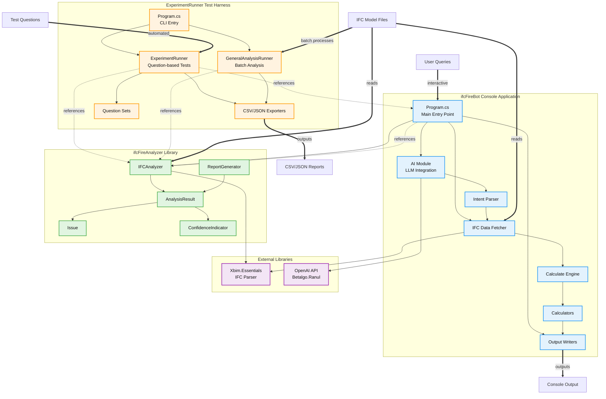

```mermaid
graph TB
    %% Main Projects
    subgraph "ifcFireAnalyzer Library"
        A1[IFCAnalyzer]
        A2[AnalysisResult]
        A3[Issue]
        A4[ConfidenceIndicator]
        A5[ReportGenerator]
        A1 --> A2
        A2 --> A3
        A2 --> A4
        A5 --> A2
    end

    subgraph "ifcFireBot Console Application"
        B1[Program.cs<br/>Main Entry Point]
        B2[AI Module<br/>LLM Integration]
        B3[Calculate Engine]
        B4[Intent Parser]
        B5[IFC Data Fetcher]
        B6[Calculators]
        B7[Output Writers]
        
        B1 --> B2
        B1 --> B5
        B1 --> A1
        B2 --> B4
        B4 --> B5
        B5 --> B3
        B3 --> B6
        B1 --> B7
        B6 --> B7
    end

    subgraph "ExperimentRunner Test Harness"
        C1[Program.cs<br/>CLI Entry]
        C2[ExperimentRunner<br/>Question-based Tests]
        C3[GeneralAnalysisRunner<br/>Batch Analysis]
        C4[CSV/JSON Exporters]
        C5[Question Sets]
        
        C1 --> C2
        C1 --> C3
        C2 --> C5
        C2 --> C4
        C3 --> C4
    end

    %% External Dependencies
    subgraph "External Libraries"
        D1[Xbim.Essentials<br/>IFC Parser]
        D2[OpenAI API<br/>Betalgo.Ranul]
    end

    %% Cross-project Dependencies
    B1 -.references.-> A1
    C2 -.references.-> B1
    C2 -.references.-> A1
    C3 -.references.-> A1
    
    %% External Dependencies
    A1 --> D1
    B5 --> D1
    B2 --> D2

    %% Data Flow
    IFC[IFC Model Files] ==>|reads| A1
    IFC ==>|reads| B5
    IFC ==>|batch processes| C3
    
    User[User Queries] ==>|interactive| B1
    Questions[Test Questions] ==>|automated| C2
    
    C4 ==>|outputs| Results[CSV/JSON Reports]
    B7 ==>|outputs| Console[Console Output]

    %% Styling
    classDef analyzer fill:#e1f5e1,stroke:#4caf50,stroke-width:2px,color:#111
    classDef bot fill:#e3f2fd,stroke:#2196f3,stroke-width:2px,color:#111
    classDef runner fill:#fff3e0,stroke:#ff9800,stroke-width:2px,color:#111
    classDef external fill:#f3e5f5,stroke:#9c27b0,stroke-width:2px,color:#111
    
    class A1,A2,A3,A4,A5 analyzer
    class B1,B2,B3,B4,B5,B6,B7 bot
    class C1,C2,C3,C4,C5 runner
    class D1,D2 external
```