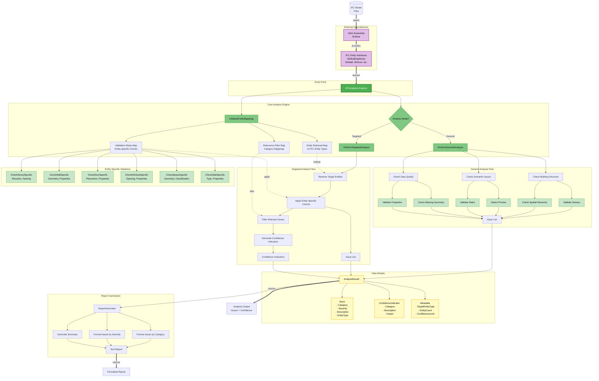

```mermaid
graph TB
    subgraph "Entry Point"
        Entry[IFCAnalyzer.Analyze]
    end
    
    subgraph "Core Analysis Engine"
        Entry --> Init[InitializeEntityMappings]
        Entry --> Decision{Analysis Mode?}
        
        Decision -->|General| General[PerformGeneralAnalysis]
        Decision -->|Targeted| Targeted[PerformTargetedAnalysis]
        
        Init --> EntityMap[Entity Retrieval Map<br/>14 IFC Entity Types]
        Init --> ChecksMap[Validation Rules Map<br/>Entity-specific Checks]
        Init --> RelevanceMap[Relevance Filter Map<br/>Category Mappings]
    end
    
    subgraph "General Analysis Flow"
        General --> G1[Check Building Structure]
        General --> G2[Check Semantic Issues]
        General --> G3[Check Data Quality]
        
        G1 --> G1a[Validate Storeys]
        G1 --> G1b[Check Spatial Hierarchy]
        G2 --> G2a[Detect Proxies]
        G2 --> G2b[Validate Stairs]
        G3 --> G3a[Check Missing Geometry]
        G3 --> G3b[Validate Properties]
        
        G1a --> Issues1[Issue List]
        G1b --> Issues1
        G2a --> Issues1
        G2b --> Issues1
        G3a --> Issues1
        G3b --> Issues1
    end
    
    subgraph "Targeted Analysis Flow"
        Targeted --> T1[Retrieve Target Entities]
        T1 --> T2[Apply Entity-Specific Checks]
        T2 --> T3[Filter Relevant Issues]
        T3 --> T4[Generate Confidence Indicators]
        
        EntityMap -.->|lookup| T1
        ChecksMap -.->|apply| T2
        RelevanceMap -.->|filter| T3
        
        T2 --> Issues2[Issue List]
        T4 --> Confidence[Confidence Indicators]
    end
    
    subgraph "Entity-Specific Validators"
        V1[CheckStoreySpecific<br/>Elevation, Naming]
        V2[CheckWallSpecific<br/>Geometry, Properties]
        V3[CheckDoorSpecific<br/>Placement, Properties]
        V4[CheckWindowSpecific<br/>Opening, Properties]
        V5[CheckSpaceSpecific<br/>Geometry, Classification]
        V6[CheckSlabSpecific<br/>Type, Properties]
        
        ChecksMap --> V1
        ChecksMap --> V2
        ChecksMap --> V3
        ChecksMap --> V4
        ChecksMap --> V5
        ChecksMap --> V6
    end
    
    subgraph "Data Models"
        Issues1 --> Result[AnalysisResult]
        Issues2 --> Result
        Confidence --> Result
        
        Result --> IssueModel[Issue<br/>- Category<br/>- Severity<br/>- Description<br/>- EntityType]
        Result --> ConfModel[ConfidenceIndicator<br/>- Category<br/>- Description<br/>- Impact]
        Result --> Metadata[Metadata<br/>- TargetEntityType<br/>- EntityCount<br/>- ConfidenceLevel]
    end
    
    subgraph "Report Generation"
        Result --> RG[ReportGenerator]
        RG --> RG1[Format Issues by Category]
        RG --> RG2[Format Issues by Severity]
        RG --> RG3[Generate Summary]
        RG1 --> Report[Text Report]
        RG2 --> Report
        RG3 --> Report
    end
    
    subgraph "External Dependencies"
        XbimStore[Xbim.Essentials<br/>IfcStore]
        XbimEntities[IFC Entity Interfaces<br/>IIfcBuildingStorey<br/>IIfcWall, IIfcDoor, etc.]
    end
    
    IFC[(IFC Model<br/>Files)] ==>|opens| XbimStore
    XbimStore ==>|provides| XbimEntities
    XbimEntities ==>|queries| Entry
    
    Result ==>|returns| Output[Analysis Output<br/>Issues + Confidence]
    Report ==>|returns| TextOutput[Formatted Report]
    
    classDef entryClass fill:#4caf50,stroke:#2e7d32,stroke-width:3px,color:#fff
    classDef coreClass fill:#81c784,stroke:#4caf50,stroke-width:2px,color:#111
    classDef validatorClass fill:#c8e6c9,stroke:#81c784,stroke-width:2px,color:#111
    classDef dataClass fill:#fff9c4,stroke:#fbc02d,stroke-width:2px,color:#111
    classDef externalClass fill:#e1bee7,stroke:#9c27b0,stroke-width:2px,color:#111
    
    class Entry entryClass
    class Init,Decision,General,Targeted coreClass
    class V1,V2,V3,V4,V5,V6,G1a,G1b,G2a,G2b,G3a,G3b validatorClass
    class Result,IssueModel,ConfModel,Metadata dataClass
    class XbimStore,XbimEntities externalClass
```