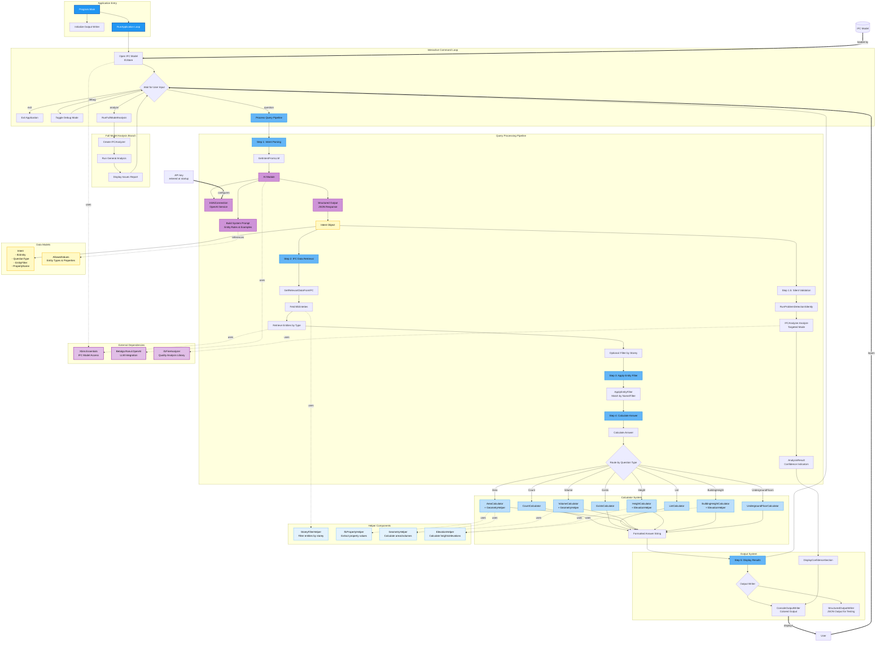

```mermaid
graph TB
    subgraph "Application Entry"
        Main[Program.Main]
        Main --> InitOutput[Initialize Output Writer]
        Main --> RunApp[RunApplication Loop]
    end
    
    subgraph "Interactive Command Loop"
        RunApp --> OpenModel[Open IFC Model<br/>IfcStore]
        OpenModel --> WaitInput{Wait for User Input}
        
        WaitInput -->|exit| Exit[Exit Application]
        WaitInput -->|debug| ToggleDebug[Toggle Debug Mode]
        WaitInput -->|analyze| FullAnalysis[RunFullModelAnalysis]
        WaitInput -->|question| ProcessQuery[Process Query Pipeline]
        
        ToggleDebug --> WaitInput
    end
    
    subgraph "Full Model Analysis Branch"
        FullAnalysis --> FA1[Create IFCAnalyzer]
        FA1 --> FA2[Run General Analysis]
        FA2 --> FA3[Display Issues Report]
        FA3 --> WaitInput
    end
    
    subgraph "Query Processing Pipeline"
        ProcessQuery --> Step1[Step 1: Intent Parsing]
        Step1 --> AICall[GetIntentFromLLM]
        
        AICall --> AI[AI Module]
        AI --> AIInit[InitAiConnection<br/>OpenAI Service]
        AI --> AIPrompt[Build System Prompt<br/>Entity Rules & Examples]
        AI --> AIStructured[Structured Output<br/>JSON Response]
        AIStructured --> IntentObj[Intent Object]
        
        IntentObj --> Step1_5[Step 1.5: Silent Validation]
        Step1_5 --> SilentCheck[RunProblemDetectionSilently]
        SilentCheck --> Analyzer2[IFCAnalyzer.Analyze<br/>Targeted Mode]
        Analyzer2 --> AnalysisResult[AnalysisResult<br/>Confidence Indicators]
        
        IntentObj --> Step2[Step 2: IFC Data Retrieval]
        Step2 --> FetchData[GetRelevantDataFromIFC]
        FetchData --> Fetcher[FetchIfcEnteties]
        Fetcher --> EntityRetrieval[Retrieve Entities by Type]
        EntityRetrieval --> FilterByStorey[Optional: Filter by Storey]
        
        FilterByStorey --> Step3[Step 3: Apply Entity Filter]
        Step3 --> NameFilter[ApplyEntityFilter<br/>Match by Name/Filter]
        
        NameFilter --> Step4[Step 4: Calculate Answer]
        Step4 --> CalcEngine[Calculate.Answer]
        CalcEngine --> CalcRouter{Route by Question Type}
    end
    
    subgraph "Calculator System"
        CalcRouter -->|Count| Calc1[CountCalculator]
        CalcRouter -->|Exists| Calc2[ExistsCalculator]
        CalcRouter -->|List| Calc3[ListCalculator]
        CalcRouter -->|Area| Calc4[AreaCalculator<br/>+ GeometryHelper]
        CalcRouter -->|Volume| Calc5[VolumeCalculator<br/>+ GeometryHelper]
        CalcRouter -->|Height| Calc6[HeightCalculator<br/>+ ElevationHelper]
        CalcRouter -->|BuildingHeight| Calc7[BuildingHeightCalculator<br/>+ ElevationHelper]
        CalcRouter -->|UndergroundFloors| Calc8[UndergroundFloorCalculator]
        
        Calc1 --> Answer[Formatted Answer String]
        Calc2 --> Answer
        Calc3 --> Answer
        Calc4 --> Answer
        Calc5 --> Answer
        Calc6 --> Answer
        Calc7 --> Answer
        Calc8 --> Answer
    end
    
    subgraph "Helper Components"
        H1[StoreyFilterHelper<br/>Filter entities by storey]
        H2[IfcPropertyHelper<br/>Extract property values]
        H3[GeometryHelper<br/>Calculate areas/volumes]
        H4[ElevationHelper<br/>Calculate heights/elevations]
        
        Fetcher -.uses.-> H1
        Calc4 -.uses.-> H2
        Calc4 -.uses.-> H3
        Calc5 -.uses.-> H3
        Calc6 -.uses.-> H4
        Calc7 -.uses.-> H4
    end
    
    subgraph "Output System"
        Answer --> Step5[Step 5: Display Results]
        Step5 --> OutWriter{Output Writer}
        
        OutWriter --> Console[ConsoleOutputWriter<br/>Colored Output]
        OutWriter --> Structured[StructuredOutputWriter<br/>JSON Output for Testing]
        
        AnalysisResult --> ConfDisplay[DisplayConfidenceSection]
        ConfDisplay --> Console
    end
    
    subgraph "Data Models"
        DM1[Intent<br/>- IfcEntity<br/>- QuestionType<br/>- EntityFilter<br/>- PropertyName]
        DM2[AllowedValues<br/>Entity Types & Properties]
        
        IntentObj --> DM1
        AIPrompt -.references.-> DM2
    end
    
    subgraph "External Dependencies"
        EXT1[Xbim.Essentials<br/>IFC Model Access]
        EXT2[Betalgo.Ranul.OpenAI<br/>LLM Integration]
        EXT3[ifcFireAnalyzer<br/>Quality Analysis Library]
        
        OpenModel -.uses.-> EXT1
        EntityRetrieval -.uses.-> EXT1
        AI -.uses.-> EXT2
        Analyzer2 -.uses.-> EXT3
    end
    
    Step5 --> WaitInput
    
    User[User] ==>|inputs| WaitInput
    Console ==>|displays| User
    IFCFile[(IFC Model)] ==>|loaded by| OpenModel
    Config[API key<br/>entered at startup] ==>|configures| AIInit
    
    classDef entryClass fill:#2196f3,stroke:#1565c0,stroke-width:3px,color:#fff
    classDef pipelineClass fill:#64b5f6,stroke:#2196f3,stroke-width:2px,color:#111
    classDef calcClass fill:#bbdefb,stroke:#64b5f6,stroke-width:2px,color:#111
    classDef helperClass fill:#e3f2fd,stroke:#90caf9,stroke-width:2px,color:#111
    classDef aiClass fill:#ce93d8,stroke:#ab47bc,stroke-width:2px,color:#111
    classDef dataClass fill:#fff9c4,stroke:#fbc02d,stroke-width:2px,color:#111
    classDef externalClass fill:#e1bee7,stroke:#9c27b0,stroke-width:2px,color:#111
    
    class Main,RunApp entryClass
    class ProcessQuery,Step1,Step2,Step3,Step4,Step5 pipelineClass
    class Calc1,Calc2,Calc3,Calc4,Calc5,Calc6,Calc7,Calc8 calcClass
    class H1,H2,H3,H4 helperClass
    class AI,AIInit,AIPrompt,AIStructured aiClass
    class DM1,DM2,IntentObj dataClass
    class EXT1,EXT2,EXT3 externalClass
```